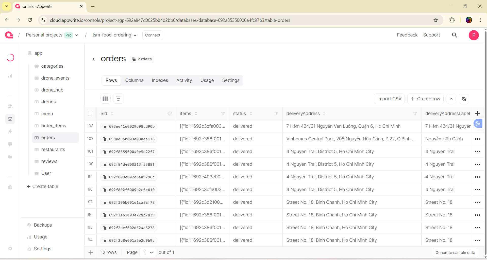

# 🍔 FoodFast — Hệ thống Quản lý Đặt Đồ Ăn

<div align="center">


[](https://reactnative.dev/)
[](https://www.typescriptlang.org/)
[](https://appwrite.io/)

**Hệ thống đặt đồ ăn trực tuyến toàn diện với giao hàng bằng drone**

*Đồ án môn Công nghệ Phần mềm - Đại học Sài Gòn (SGU)*

</div>

---

## 📋 Mục lục

- [Giới thiệu](#-giới-thiệu)
- [Video Demo](#-video-demo)
- [Tính năng nổi bật](#-tính-năng-nổi-bật)
- [Kiến trúc hệ thống](#-kiến-trúc-hệ-thống)
- [Cấu trúc dự án](#-cấu-trúc-dự-án)
- [Các Module Chính](#-các-module-chính)
- [Công nghệ sử dụng](#-công-nghệ-sử-dụng)
- [Yêu cầu hệ thống](#-yêu-cầu-hệ-thống)
- [Hướng dẫn cài đặt](#-hướng-dẫn-cài-đặt)
- [Chạy ứng dụng](#-chạy-ứng-dụng)
- [Tính năng chi tiết](#-tính-năng-chi-tiết)
- [API và Cloud Functions](#-api-và-cloud-functions)
- [Database Schema](#-database-schema)
- [Tài liệu](#-tài-liệu)
- [Roadmap](#-roadmap)
- [Đóng góp](#-đóng-góp)
- [Liên hệ](#-liên-hệ)

---

## 🎯 Giới thiệu

**FoodFast** là nền tảng đặt món ăn trực tuyến hiện đại, kết nối **khách hàng**, **nhà hàng**, và **quản trị viên** trong một hệ sinh thái thống nhất. Hệ thống được phát triển với công nghệ tiên tiến, tích hợp:

- ✨ **Ứng dụng di động** cho khách hàng (React Native + Expo)
- 🍽️ **Portal quản lý** cho nhà hàng (React + Vite)
- 🧑‍💼 **Portal quản trị** cho admin (React + Vite)
- 🤖 **Giao hàng bằng drone** với theo dõi real-time
- 📱 **Push notifications** tự động khi cập nhật đơn hàng
- 💳 **Thanh toán trực tuyến** an toàn

Người dùng có thể duyệt menu, đặt món, thanh toán, và theo dõi giao hàng theo thời gian thực — bao gồm mô phỏng **drone giao hàng** trong tương lai.

---

## 📺 Video Demo

### 1️⃣ **Video Khởi Động** (`video1_khoidong`)
Giới thiệu ứng dụng mobile, giao diện khi chưa đăng nhập, overview các màn hình chính.

https://github.com/nguyen-hong-tham/-FoodFast-Drone-Food-Delivery-System/releases/tag/v1.0


### 2️⃣ **Video Đăng Nhập & Đặt Món** (`video2_login`)
Hướng dẫn đăng nhập vào hệ thống, duyệt menu, tùy chỉnh món ăn và đặt hàng.

https://github.com/nguyen-hong-tham/-FoodFast-Drone-Food-Delivery-System/releases/tag/v2

---

### 3️⃣ **Video Theo Dõi Đơn Hàng & Drone** (`video3_tracking`)
Hiển thị quá trình sau khi đơn hàng được xác nhận, theo dõi drone giao hàng real-time trên bản đồ.

https://github.com/nguyen-hong-tham/-FoodFast-Drone-Food-Delivery-System/releases/tag/v3


---

### 4️⃣ **Video Admin & Restaurant Portal** (`videoDrone2`)
Hướng dẫn đăng nhập vào **Admin Portal**, **Restaurant Portal**, và **Mobile App**. Mô tả quy trình xử lý đơn hàng từ restaurant, quản lý drone fleet bởi admin.

https://github.com/nguyen-hong-tham/-FoodFast-Drone-Food-Delivery-System/releases/tag/v4_project

---

## ✨ Tính năng nổi bật

### 🚀 Công nghệ tiên tiến
- **Real-time tracking**: Theo dõi drone giao hàng trên bản đồ
- **Push notifications**: Thông báo tức thời qua Expo Notifications
- **Responsive design**: Tối ưu cho mobile, tablet, desktop
- **Cloud-based**: Backend hoàn toàn serverless với Appwrite

### 🔐 Bảo mật
- Xác thực đa lớp (JWT tokens, session management)
- Role-based access control (Customer, Restaurant, Admin)
- Mã hóa dữ liệu nhạy cảm
- Secure payment processing

### 📊 Phân tích dữ liệu
- Dashboard thống kê doanh thu
- Báo cáo đơn hàng theo thời gian thực
- Analytics cho nhà hàng và admin
- Biểu đồ trực quan với Recharts

---

## 🏗️ Kiến trúc hệ thống

```
┌─────────────────┐         ┌──────────────────┐         ┌─────────────────┐
│   Mobile App    │         │  Restaurant Web  │         │   Admin Web     │
│  (React Native) │         │   (Vite+React)   │         │  (Vite+React)   │
└────────┬────────┘         └────────┬─────────┘         └────────┬────────┘
         │                           │                            │
         └───────────────────────────┼────────────────────────────┘
                                     │
                          ┌──────────▼──────────┐
                          │   Appwrite Cloud    │
                          │  ┌──────────────┐   │
                          │  │  Database    │   │
                          │  │  Auth        │   │
                          │  │  Storage     │   │
                          │  │  Functions   │   │
                          │  │  Realtime    │   │
                          │  └──────────────┘   │
                          └─────────────────────┘
```

---

## 📁 Cấu trúc dự án

```
sgu_cnpm_foodfast/
│
├── mobile/                  # 📱 Ứng dụng khách hàng (React Native + Expo)
│   ├── app/                 # Màn hình: Home, Search, Cart, Profile, Auth
│   │   ├── (tabs)/          # Bottom tab navigation
│   │   ├── (auth)/          # Authentication screens
│   │   ├── restaurant/      # Restaurant details
│   │   ├── checkout/        # Checkout flow
│   │   └── tracking/        # Order tracking with map
│   ├── components/          # Thành phần tái sử dụng
│   │   ├── cards/           # Restaurant cards, menu items
│   │   ├── modals/          # Bottomsheets, dialogs
│   │   └── tracking/        # Delivery map, status
│   ├── lib/                 # Kết nối Appwrite, utilities
│   ├── store/               # Zustand stores (auth, cart, location)
│   ├── constants/           # Constants, configuration
│   └── assets/              # Images, icons, fonts
│
├── restaurant/              # 🍽️ Cổng quản lý cho nhà hàng (Vite + React)
│   ├── src/
│   │   ├── pages/           # Dashboard, Menu, Orders, Analytics, Settings
│   │   ├── components/      # React components
│   │   │   ├── Layout.tsx   # Main layout with sidebar
│   │   │   ├── Sidebar.tsx  # Navigation sidebar
│   │   │   └── ...
│   │   ├── lib/             # Appwrite client, API utilities
│   │   ├── store/           # Zustand state management
│   │   └── types/           # TypeScript type definitions
│   └── package.json
│
├── admin/                   # 🧑‍💼 Cổng quản trị hệ thống (Vite + React)
│   ├── src/
│   │   ├── pages/           # Dashboard, Orders, Customers, Products
│   │   │   ├── Dashboard.tsx      # Overview statistics
│   │   │   ├── OrdersPage.tsx     # Order management
│   │   │   ├── CustomersPage.tsx  # User management
│   │   │   ├── ProductsPage.tsx   # Menu management
│   │   │   └── CategoriesPage.tsx # Category management
│   │   ├── components/      # Shared components
│   │   ├── lib/             # Appwrite & API
│   │   ├── store/           # Auth store (Zustand)
│   │   └── types/           # TypeScript interfaces
│   └── package.json
│
├── functions/               # ☁️ Appwrite Cloud Functions
│   └── send-notification/   # Push notification service
│       ├── src/main.js      # Function entry point
│       └── package.json
│
├── shared/                  # 🔄 Mã dùng chung giữa các module
│   ├── types/               # TypeScript types & interfaces
│   ├── constants/           # Shared constants
│   └── utils/               # Utility functions
│
├── docs/                    # 📚 Tài liệu dự án
│   ├── database/            # Database schemas, setup guides
│   ├── api/                 # API documentation
│   └── deployment/          # Deployment guides
│
├── drawio/                  # 📐 Sơ đồ thiết kế (UML, ERD, usecase)
│
├── .gitignore
└── README.md                # This file
```

---

## 🧩 Các Module Chính

### 1. **Mobile App** (`/mobile`) 📱

> Ứng dụng dành cho khách hàng - **React Native + Expo**

**Tính năng:**
- ✅ Đăng ký / Đăng nhập với email/password
- ✅ Duyệt danh sách nhà hàng với tìm kiếm và lọc
- ✅ Xem menu chi tiết với customization options
- ✅ Giỏ hàng thông minh với tính tổng tự động
- ✅ Thanh toán (COD, Credit Card, E-wallet)
- ✅ Theo dõi đơn hàng real-time trên bản đồ
- ✅ Theo dõi drone giao hàng với ETA
- ✅ Push notifications cho cập nhật đơn hàng
- ✅ Lịch sử đơn hàng và đánh giá
- ✅ Quản lý địa chỉ giao hàng
- ✅ Dark mode support

**Công nghệ:**
- React Native 0.81 + Expo 54
- TypeScript
- Expo Router (file-based routing)
- NativeWind (TailwindCSS for React Native)
- Zustand (State Management)
- React Native Maps (Bản đồ)
- Expo Notifications (Push notifications)
- React Native Appwrite SDK

**Màn hình chính:**
```
Home → Restaurant Details → Menu → Cart → Checkout → Order Tracking
Search → Categories → Filter
Profile → Orders History → Settings
```

---

### 2. **Restaurant Portal** (`/restaurant`) 🍽️

> Cổng quản lý dành cho nhà hàng - **Vite + React**

**Tính năng:**
- ✅ Đăng nhập dành riêng cho nhà hàng
- ✅ Setup wizard (2 bước) cho nhà hàng mới
- ✅ Dashboard với thống kê doanh thu
- ✅ Quản lý menu (CRUD món ăn)
- ✅ Nhận đơn hàng real-time
- ✅ Cập nhật trạng thái đơn hàng
- ✅ Quản lý customization options
- ✅ Upload ảnh món ăn
- ✅ Cài đặt thông tin nhà hàng (location, logo, cover)
- ✅ Analytics và báo cáo

**Công nghệ:**
- React 18 + Vite 6
- TypeScript
- React Router DOM 6
- Tailwind CSS
- Zustand (Persistent auth)
- Appwrite Web SDK
- Recharts (Charts & Analytics)
- Lucide React (Icons)

**Trạng thái đơn hàng:**
```
pending → confirmed → preparing → ready → delivering → delivered
```

---

### 3. **Admin Portal** (`/admin`) 🧑‍💼

> Quản trị hệ thống - **Vite + React**

**Tính năng:**
- ✅ Dashboard tổng quan toàn hệ thống
- ✅ Quản lý nhà hàng (approve/reject)
- ✅ Quản lý khách hàng và users
- ✅ Quản lý danh mục sản phẩm
- ✅ Quản lý tất cả đơn hàng
- ✅ Xem chi tiết đơn hàng trên map
- ✅ Quản lý drone fleet
- ✅ Báo cáo và thống kê doanh thu
- ✅ Cấu hình hệ thống

**Công nghệ:**
- React 18 + Vite 6
- TypeScript
- Tailwind CSS
- Zustand
- Appwrite SDK
- React Leaflet (Maps)
- Recharts (Analytics)

**Dashboard metrics:**
- Total orders, revenue
- Active users, restaurants
- Drone fleet status
- Order completion rate

---

### 4. **Cloud Functions** (`/functions`) ☁️

> Backend logic với Appwrite Functions - **Node.js 18**

**Functions hiện có:**

#### `send-notification`
Gửi push notifications đến mobile app khi có order updates.

**Triggers:**
- Order status changed
- Drone dispatched
- Delivery completed
- Manual call từ restaurant/admin portal

**Events:**
```javascript
databases.*.collections.orders.documents.*.update
```

**Technology:**
- Node.js 18
- node-appwrite SDK
- Expo Push Notifications API

---

## 🛠 Công Nghệ Sử Dụng

### Frontend
| Công nghệ | Phiên bản | Mục đích |
|-----------|-----------|----------|
| React | 18.3.1 | UI Library |
| React Native | 0.81.4 | Mobile Framework |
| TypeScript | 5.7.2 | Type Safety |
| Expo | 54.0.10 | Mobile Development Platform |
| Vite | 6.0.3 | Build Tool |
| TailwindCSS | 3.4.15 | Styling |
| NativeWind | 4.2.1 | TailwindCSS for RN |

### State Management & Routing
| Công nghệ | Mục đích |
|-----------|----------|
| Zustand | Global State Management |
| React Router DOM | Web Navigation |
| Expo Router | Mobile Navigation |

### Backend & Database
| Công nghệ | Mục đích |
|-----------|----------|
| Appwrite | BaaS (Auth, Database, Storage, Functions) |
| Node.js | Cloud Functions Runtime |

### Maps & Location
| Công nghệ | Mục đích |
|-----------|----------|
| React Native Maps | Mobile Maps |
| React Leaflet | Web Maps |
| Expo Location | Geolocation API |

### UI Components & Icons
| Công nghệ | Mục đích |
|-----------|----------|
| Lucide React | Icon Library |
| Recharts | Charts & Analytics |
| React Hook Form | Form Management |

---

## 💻 Yêu Cầu Hệ Thống

### Phát triển
```
Node.js >= 18.0.0
npm >= 9.0.0 (hoặc yarn/pnpm)
Expo CLI (installed globally hoặc via npx)
```

### Mobile Development
```
iOS: Xcode 15+ (macOS only)
Android: Android Studio + JDK 17
Expo Go app (for testing on physical devices)
```

### Appwrite Backend
```
Appwrite Cloud account (https://cloud.appwrite.io)
hoặc Self-hosted Appwrite instance
```

---

## 🚀 Hướng dẫn Cài Đặt

### 1. Clone Repository

```bash
git clone https://github.com/phatle224/sgu_cnpm_foodfast.git
cd sgu_cnpm_foodfast
```

### 2. Cài đặt Dependencies

#### Mobile App
```bash
cd mobile
npm install
```

#### Restaurant Portal
```bash
cd restaurant
npm install
```

#### Admin Portal
```bash
cd admin
npm install
```

### 3. Cấu hình Appwrite

#### Bước 3.1: Tạo Project trên Appwrite Cloud

1. Truy cập https://cloud.appwrite.io
2. Tạo project mới: **"FoodFast"**
3. Copy **Project ID** và **API Endpoint**

#### Bước 3.2: Tạo Database & Collections

Xem hướng dẫn chi tiết tại: `docs/database/APPWRITE_SETUP_GUIDE.md`

**Collections cần tạo:**
- `user` - User profiles
- `restaurants` - Restaurant information
- `menu` - Menu items
- `categories` - Food categories
- `orders` - Orders
- `order_items` - Order details
- `payments` - Payment transactions
- `customizations` - Customization options
- `menu_customizations` - Menu customization relations
- `reviews` - Restaurant reviews
- `notifications` - User notifications
- `drones` - Drone fleet

#### Bước 3.3: Tạo Storage Bucket

```
Bucket Name: foodfast-images
Permissions: 
  - Read: any
  - Create: users
  - Update: users
  - Delete: users
```

### 4. Cấu hình Environment Variables

#### Mobile App (`mobile/.env`)
```bash
cp mobile/.env.example mobile/.env
```

```env
EXPO_PUBLIC_APPWRITE_ENDPOINT=https://cloud.appwrite.io/v1
EXPO_PUBLIC_APPWRITE_PROJECT_ID=your_project_id
EXPO_PUBLIC_APPWRITE_DATABASE_ID=your_database_id
EXPO_PUBLIC_APPWRITE_USER_COLLECTION_ID=user
EXPO_PUBLIC_APPWRITE_RESTAURANTS_COLLECTION_ID=restaurants
EXPO_PUBLIC_APPWRITE_MENU_COLLECTION_ID=menu
EXPO_PUBLIC_APPWRITE_CATEGORIES_COLLECTION_ID=categories
EXPO_PUBLIC_APPWRITE_ORDERS_COLLECTION_ID=orders
EXPO_PUBLIC_APPWRITE_ORDER_ITEMS_COLLECTION_ID=order_items
EXPO_PUBLIC_APPWRITE_BUCKET_ID=your_bucket_id
```

#### Restaurant Portal (`restaurant/.env`)
```bash
cp restaurant/.env.example restaurant/.env
```

```env
VITE_APPWRITE_ENDPOINT=https://cloud.appwrite.io/v1
VITE_APPWRITE_PROJECT_ID=your_project_id
VITE_APPWRITE_DATABASE_ID=your_database_id
VITE_APPWRITE_USERS_COLLECTION_ID=user
VITE_APPWRITE_RESTAURANTS_COLLECTION_ID=restaurants
VITE_APPWRITE_MENU_COLLECTION_ID=menu
VITE_APPWRITE_ORDERS_COLLECTION_ID=orders
VITE_APPWRITE_ORDER_ITEMS_COLLECTION_ID=order_items
VITE_APPWRITE_BUCKET_ID=your_bucket_id
```

#### Admin Portal (`admin/.env`)
```bash
cp admin/.env.example admin/.env
```

```env
VITE_APPWRITE_ENDPOINT=https://cloud.appwrite.io/v1
VITE_APPWRITE_PROJECT_ID=your_project_id
VITE_APPWRITE_DATABASE_ID=your_database_id
VITE_APPWRITE_USER_COLLECTION_ID=user
VITE_APPWRITE_RESTAURANTS_COLLECTION_ID=restaurants
VITE_APPWRITE_MENU_COLLECTION_ID=menu
VITE_APPWRITE_ORDERS_COLLECTION_ID=orders
VITE_APPWRITE_BUCKET_ID=your_bucket_id
```

---

## 🎮 Chạy Ứng Dụng

### Development Mode

| Ứng dụng | Lệnh chạy | URL/Access |
|----------|-----------|------------|
| **Mobile App** | `cd mobile && npx expo start` | Quét QR bằng Expo Go |
| **Restaurant Portal** | `cd restaurant && npm run dev` | http://localhost:3001 |
| **Admin Portal** | `cd admin && npm run dev` | http://localhost:3002 |

### Production Build

#### Mobile App
```bash
# iOS
cd mobile
eas build --platform ios

# Android
eas build --platform android
```

#### Web Portals
```bash
# Restaurant
cd restaurant
npm run build
npm run preview

# Admin
cd admin
npm run build
npm run preview
```

---

## 📱 Tính năng Chi tiết

### 👤 Khách Hàng (Mobile App)

#### 🔐 Authentication
- [x] Đăng ký với email/password
- [x] Đăng nhập persistent
- [x] Quên mật khẩu
- [x] Profile management

#### 🏪 Duyệt & Tìm Kiếm
- [x] Danh sách nhà hàng với filter
- [x] Tìm kiếm theo tên/danh mục
- [x] Xem menu chi tiết
- [x] Customization options cho món ăn
- [x] Rating & reviews

#### 🛒 Đặt Hàng
- [x] Thêm vào giỏ hàng
- [x] Chỉnh sửa số lượng
- [x] Áp dụng mã giảm giá
- [x] Chọn địa chỉ giao hàng
- [x] Chọn phương thức thanh toán

#### 📍 Theo Dõi Đơn Hàng
- [x] Real-time order status
- [x] Theo dõi drone trên bản đồ
- [x] ETA (Estimated Time of Arrival)
- [x] Push notifications
- [x] Lịch sử đơn hàng

---

### 🍽 Nhà Hàng (Restaurant Portal)

#### 📊 Dashboard
- [x] Thống kê doanh thu hôm nay
- [x] Số đơn hàng mới
- [x] Biểu đồ doanh thu theo tuần
- [x] Top selling items

#### 🍕 Quản Lý Menu
- [x] CRUD món ăn
- [x] Upload ảnh món ăn
- [x] Quản lý giá & stock
- [x] Customization options
- [x] Danh mục món ăn

#### 📦 Quản Lý Đơn Hàng
- [x] Nhận đơn real-time
- [x] Xác nhận/Từ chối đơn
- [x] Cập nhật trạng thái
- [x] Xem chi tiết khách hàng
- [x] In hóa đơn

**Cập nhật đơn hàng trong Database:**



*Hình trên mô tả quá trình database cập nhật thông tin đơn hàng mới khi nhà hàng và admin xử lý.*

#### ⚙️ Cài Đặt
- [x] Cập nhật thông tin nhà hàng
- [x] Upload logo & cover image
- [x] Cài đặt location (lat/lng)
- [x] Giờ mở/đóng cửa

---

### 🧑‍💼 Quản Trị Viên (Admin Portal)

#### 📊 Dashboard
- [x] Tổng quan toàn hệ thống
- [x] Thống kê users, restaurants, orders
- [x] Biểu đồ doanh thu
- [x] Map view tất cả đơn hàng

#### 🏪 Quản Lý Nhà Hàng
- [x] Approve/Reject đăng ký nhà hàng
- [x] Xem danh sách nhà hàng
- [x] Chỉnh sửa thông tin
- [x] Khóa/Mở khóa tài khoản

#### 👥 Quản Lý Người Dùng
- [x] Danh sách users
- [x] Xem chi tiết profile
- [x] Thống kê đơn hàng user
- [x] Role management

#### 📦 Quản Lý Đơn Hàng
- [x] Xem tất cả đơn hàng
- [x] Filter theo status, date
- [x] Xem chi tiết trên map
- [x] Export báo cáo

#### 🏷️ Quản Lý Danh Mục
- [x] CRUD categories
- [x] Upload category icons
- [x] Sắp xếp thứ tự

---

## ☁️ API và Cloud Functions

### Appwrite Collections API

#### Authentication
```typescript
// Register
account.create(ID.unique(), email, password, name)

// Login
account.createEmailPasswordSession(email, password)

// Get current user
account.get()
```

#### Database Operations
```typescript
// List documents
databases.listDocuments(databaseId, collectionId, [
  Query.equal('status', 'active'),
  Query.orderDesc('$createdAt'),
  Query.limit(25)
])

// Create document
databases.createDocument(databaseId, collectionId, ID.unique(), data)

// Update document
databases.updateDocument(databaseId, collectionId, documentId, data)
```

#### Storage
```typescript
// Upload file
storage.createFile(bucketId, ID.unique(), file)

// Get file URL
storage.getFileView(bucketId, fileId)
```

#### Realtime Subscriptions
```typescript
client.subscribe('databases.*.collections.orders.documents', response => {
  // Handle order updates
  console.log(response.payload)
})
```

### Cloud Functions

#### Send Notification Function

**Deployment:**
```bash
cd functions/send-notification
npm install
appwrite functions createDeployment \
  --functionId=send-notification \
  --entrypoint=src/main.js \
  --code=.
```

**Usage:**
```typescript
import { functions } from './lib/appwrite'

// Send notification
await functions.createExecution(
  'send-notification',
  JSON.stringify({
    userId: 'user123',
    title: 'Order Confirmed',
    body: 'Your order has been accepted!',
    data: { orderId: 'order123', type: 'order_update' }
  })
)
```

**Xem thêm:** `functions/send-notification/README.md`

---

## 🗃️ Database Schema

### Collections Overview

| Collection | Documents | Purpose |
|-----------|-----------|---------|
| `user` | ~1000+ | User profiles & authentication |
| `restaurants` | ~100+ | Restaurant information |
| `menu` | ~1000+ | Menu items |
| `categories` | ~20 | Food categories |
| `orders` | ~5000+ | Customer orders |
| `order_items` | ~15000+ | Order details |
| `payments` | ~5000+ | Payment transactions |
| `reviews` | ~2000+ | Restaurant reviews |
| `notifications` | ~10000+ | Push notifications log |
| `drones` | ~50 | Drone fleet |

### Mô Phỏng Database Appwrite


*Hình trên mô tả cấu trúc database trong Appwrite với các collections, relationships, và attributes.*

### Key Relationships

```
user (1) ──< (N) orders
restaurants (1) ──< (N) menu
restaurants (1) ──< (N) orders
orders (1) ──< (N) order_items
menu (1) ──< (N) order_items
orders (1) ──── (1) payments
orders (1) ──── (1) drones
```

**Xem schema đầy đủ:** `docs/database/DATABASE_SCHEMA.md`

---

## 📚 Tài Liệu

### Hướng dẫn thiết lập
- [Appwrite Setup Guide](docs/database/APPWRITE_SETUP_GUIDE.md) - Hướng dẫn setup Appwrite từ đầu
- [Database Schema](docs/database/DATABASE_SCHEMA.md) - Chi tiết schema và relationships
- [Restaurant Portal Login Fix](docs/RESTAURANT_PORTAL_LOGIN_FIX.md) - Troubleshooting login issues

### API Documentation
- [Appwrite API Reference](https://appwrite.io/docs) - Official Appwrite docs
- [Cloud Functions Guide](functions/send-notification/README.md) - Hướng dẫn cloud functions

### Development Guides
- [Mobile App README](mobile/README.md) - Mobile development guide
- [Restaurant Portal README](restaurant/README.md) - Restaurant portal guide
- [Admin Portal README](admin/README.md) - Admin portal guide

### Project Management
- [GitHub Issues Template](docs/GITHUB-ISSUES.md) - Template tạo issues cho project

---

## 🗺️ Roadmap

### Phase 1: Core Features ✅ (Completed)
- [x] Authentication & user management
- [x] Restaurant & menu management
- [x] Order placement & tracking
- [x] Basic payment integration
- [x] Mobile app (iOS/Android)
- [x] Restaurant portal
- [x] Admin portal

### Phase 2: Advanced Features 🔄 (In Progress)
- [x] Real-time order tracking
- [x] Push notifications
- [ ] Drone delivery simulation (customer can see drone on map)
- [ ] Admin real-time tracking drone fleet on map
- [ ] Payment gateway integration (Stripe/PayPal)
- [ ] Rating & review system
- [ ] Advanced analytics

### Phase 3: Optimization 📋 (Planned)
- [ ] Performance optimization
- [ ] Offline mode for mobile
- [ ] Advanced search & filters
- [ ] Loyalty program
- [ ] Referral system
- [ ] Multi-language support

### Phase 4: Scalability 🚀 (Future)
- [ ] Microservices architecture
- [ ] Real drone integration
- [ ] AI-powered recommendations
- [ ] Chat support
- [ ] Social features

---

## 👥 Đóng Góp

Dự án này được phát triển bởi sinh viên **Đại học Sài Gòn (SGU)** cho môn **Công nghệ Phần mềm**.

### Team Members
- **Project Lead**: [Your Name] - Full Stack Developer
- **Mobile Developer**: [Name] - React Native
- **Backend Developer**: [Name] - Appwrite & Cloud Functions
- **UI/UX Designer**: [Name] - Design & Prototyping

### Contribution Guidelines

1. Fork repository
2. Tạo branch mới: `git checkout -b feature/AmazingFeature`
3. Commit changes: `git commit -m 'Add some AmazingFeature'`
4. Push to branch: `git push origin feature/AmazingFeature`
5. Mở Pull Request

**Coding Standards:**
- TypeScript strict mode
- ESLint + Prettier
- Conventional Commits
- Component documentation

---

## 📝 License

This project is licensed under the MIT License - see the [LICENSE](LICENSE) file for details.

**Note:** This is an educational project developed for academic purposes.

---

## 📞 Liên Hệ

- **Email**: phatle224@example.com
- **GitHub**: [@phatle224](https://github.com/phatle224)
- **Project Repository**: [sgu_cnpm_foodfast](https://github.com/phatle224/sgu_cnpm_foodfast)

---

## 🙏 Acknowledgments

- [Appwrite](https://appwrite.io) - Backend as a Service platform
- [Expo](https://expo.dev) - Mobile development platform
- [React](https://react.dev) - UI library
- [Đại học Sài Gòn](https://www.sgu.edu.vn) - Môn Công nghệ Phần mềm

---

<div align="center">

**Made with ❤️ by SGU Students**

⭐ Star this repository if you find it helpful!

</div>
